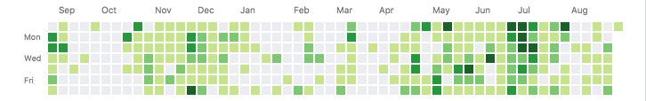

# capture-github-kusa

[](https://greenkeeper.io/)
[](https://travis-ci.org/akameco/capture-github-kusa)
[](https://github.com/prettier/prettier)

> Caputre github kusa


## Install

```
$ npm install capture-github-kusa
```


## Usage

```js
const fs = require('fs');
const captureGithubKusa = require('capture-github-kusa');

captureGithubKusa('akameco').then(img => {
  fs.writeFileSync('github.png', img)
})
```

github.png



## API

### captureGithubKusa(username)

#### username

Type: `string`

GitHub username.


## License

MIT © [akameco](http://akameco.github.io)
